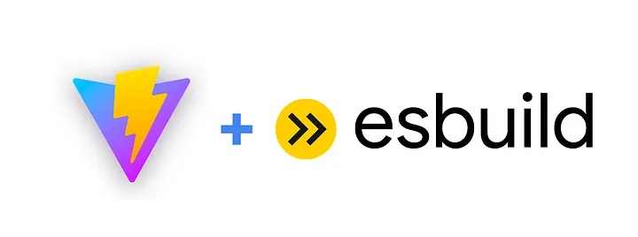
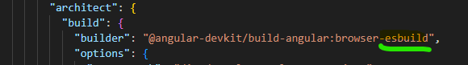
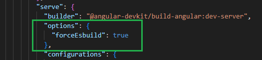

# Description 

Each subdirectory holds a different Dockerfile for various builds.

During the build process, the docker image is given the same name as the subdirectory housing the build file.


# Build command

```bash 
cd path-of-subdirectory
../build 
```

Include option `--progress=plain` to print verbosely.

Include option `--no-cache` to clear your local docker build cache.

# Run commands


```bash
cd path-to-your-files
docker run -it -v /"${PWD}":/home/user/work    docker-image-name
```

The option `-v /"${PWD}":/home/user/work` causes your files in the current directory to be *mounted* at `/home/user/work` inside the container. Any changes made inside the container will change the files that are outside the container.

The option `-it` puts you in an interactive tty terminal.

Include option `-name container-name` to give your container a name

Include option `-rm` to delete the container upon exit (and start anew the next time).

Include option `-u 0` to have root access inside the container

Include option `-p port_outside:port_inside` for each TCP/IP port that is needed.

Once inside the container, type the following to verify the versions of commands in use:

```bash
info
```


# git set up

```bash
git config --global user.email "you@example.com"
git config --global user.name "Your Name"
```

Do not use option `-rm` in `docker run` command if you want the git info to persist.


# Connecting to a Container with VS Code

https://code.visualstudio.com/docs/devcontainers/attach-container  

To attach to a Docker container, either 

- Step 1: Hit F1 by and type `Dev Containers: Attach to Running Container...` in the Command Palette

 


- or use the **Remote Explorer** in the **Activity Bar** and from the **Containers** view, select the **Attach to Container** inline action on the container you want to connect to.
- 


# pnpm

https://pnpm.io/package_json 

## package.json

The manifest file of a package. It contains all the package's metadata, including dependencies, title, author, et cetera. This is a standard preserved across all major Node.JS package managers, including pnpm.

You can specify the version of Node and pnpm that your software works on:

```json
{
    "engines": {
        "node": ">=10",
        "pnpm": ">=3"
    }
}
```

During local development, pnpm will always fail with an error message if its version does not match the one specified in the engines field.
Unless the user has set the engine-strict config flag (see .npmrc), this field is advisory only and will only produce warnings when your package is installed as a dependency.


# Angular projects

By default, Angular needs that you have git and git credentials set up because it sets up a git project.  However, it's best to include the option `--skip-git` during ng project creation and use git outside the container.

Include option `-p 4200:4200` in `docker run` command so that `ng serve` works.

Also make sure that `EXPOSE 4200` is included in the Dockerfile.

Keep in mind that the first time you run `ng serve` inside a project takes a very long time, >10 minutes.


## Selecting Angular Version for Your Project

The current version of the global Angular CLI determines the version of Angular to be used.  (Likewise for node and npm.)

```bash
nvm use node-version
npm install -g @angular/cli@angular-string
```

where `node-string` is the nodejs version you want, eg `18.18` and `angular-string` is the Angular version you want, eg `16.2.5`

## project creation with npm
```bash
cd work  # <--- MAKE SURE TO DO THIS OR YOUR WORK WILL NOT BE SAVED
ng new sample-project  --skip-git
cd sample-project
npm install --save-dev typescript
```

## project creation with pnpm
```bash
cd work  # <--- MAKE SURE TO DO THIS OR YOUR WORK WILL NOT BE SAVED
ng new sample-project --minimal --skip-tests --skip-git --package-manager=pnpm
cd sample-project
pnpm add typescript
```

### changing package manager


> [!WARNING]
> Always use care when performing `rm -fr`

```bash
rm -fr node_modules/
```

Add the following to `angular.json`
```json
  "cli": {
    "packageManager": "<package-manager>"
  },
```

where `<package-manager>` is either `pnpm`, `npm`, `yarn`.


## Serving content in development

```bash
ng serve --host 0.0.0.0 --disable-host-check
```

### Using integrated vite / esbuild in Angular 16



>In ng serve we’re now using Vite for the development server, and esbuild powers both your development and production builds!
>
>We want to emphasize that Angular CLI relies on Vite exclusively as a development server. To support selector matching, the Angular compiler needs to maintain a dependency graph between your components which requires a different compilation model than Vite.


https://blog.angular.io/angular-v16-is-here-4d7a28ec680d


#### Using vite during `ng build`

In your project `angular.json`, add `-esbuild` to the following line




#### Using vite during `ng serve`

Then (also in `angular.json`) add the text
```json
          "options": {
            "forceEsbuild": true
          },
```

in the following location




## Jest support in Angular 16

Install jest

```bash
npm install jest --save-dev
```

Add the following to your `angular.json`
```json
  "projects": {
    "my-app": {
      "architect": {
        "test": {
          "builder": "@angular-devkit/build-angular:jest",
          "options": {
            "tsConfig": "tsconfig.spec.json",
            "polyfills": ["zone.js", "zone.js/testing"]
          }
        }
      }
   }
  }
```
